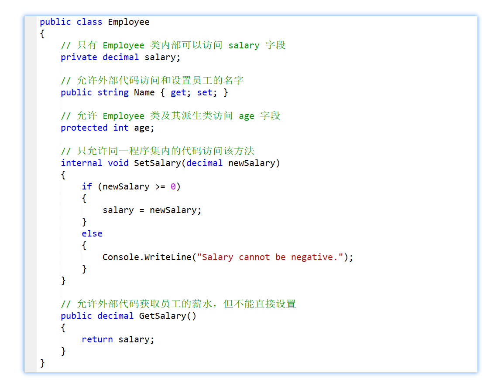

## 程序结构

`C#` 是一种强类型、面向对象的编程语言，它由微软开发，并作为`.NET`框架的一部分。

### 基本概念

- `C#` 源代码文件的后缀为 `.cs`。
- `C#` 是大小写敏感的语言，即变量名 `myVariable` 和 `MyVariable` 是两个不同的变量。
- `C#` 中所有语句和表达式都必须以分号（`;`）结尾。
- 与 `Java` 不同，`C#` 允许文件名与其中定义的类的名称不同。

### 注释

单行注释使用两个斜杠`//`，例如：`// 这是一个单行注释`

多行注释（块注释）使用 `/*` 开始，`*/` 结束，例如：

```csharp
/*
这是一个多行注释。
可以跨越多行。
*/
```

### Hello World

在`C#`中，每个可执行程序都必须包含一个`Main`方法，这是程序的入口点，是程序开始执行的地方。`Main`方法可以包含在类或结构中，但最常见的做法是将其放在类中。

示例代码如下：

```csharp
using System;

class Program
{
    static void Main()
    {
        Console.WriteLine("Hello, World!");
    }
}
```

要点：

- `using System;`：这一行是一个`using`指令，它告诉编译器我们将在程序中使用`System`命名空间。`System`命名空间包含定义基本系统功能的类型，例如控制台输入/输出（`I/O`）。一个程序可以包含多个 `using` 语句。

- `class Program`：**class** 关键字用于声明一个类。这里定义了一个名为`Program`的类。

- `static void Main()`：这定义了一个名为`Main`的方法。`static`关键字表示这个方法属于类本身，而不是类的实例。`void`关键字表示这个方法不返回值。`Main`方法的括号中可以包含参数，用于接收命令行参数。

- `Console.WriteLine("Hello, World!");`：这一行代码使用`Console`类的`WriteLine`方法在控制台上输出文本“Hello, World!”。`Console`类是`System`命名空间的一部分，用于控制台应用程序的输入和输出。

我们可以在Visual Studio中创建一个新的控制台应用程序项目（Console Application），将上述代码粘贴到主类中，然后编译并运行项目：


## 数据类型

C# 是一种强类型语言，每个变量和常量都必须声明其数据类型。C# 中的数据类型主要分为两大类：值类型（Value Types）和引用类型（Reference Types）。

### 值类型

值类型（Value Types）的变量直接存储数据，它们是从类 **`System.ValueType`** 中派生的，存储在栈上。当声明这种类型的变量时，系统会分配内存来直接存储值。

不能从值类型派生出新类型，值类型不能包含 `null` 值。

| 类型分类                   | 类型名称   | 描述                                                         |
| -------------------------- | ---------- | ------------------------------------------------------------ |
| 简单类型（Simple Types）   | 整数类型   | `byte`（8位无符号整数）、`sbyte`（8位有符号整数）、`short`（16位有符号整数）、`ushort`（16位无符号整数）、`int`（32位有符号整数）、`uint`（32位无符号整数）、`long`（64位有符号整数）、`ulong`（64位无符号整数） |
|                            | 浮点类型   | `float`（32位单精度浮点数）、`double`（64位双精度浮点数）    |
|                            | 十进制类型 | `decimal`（128位精确的十进制数，适用于财务和货币计算）       |
|                            | 布尔类型   | `bool`（表示真或假的逻辑值）                                 |
|                            | 字符类型   | `char`（16位 Unicode 字符）                                  |
| 枚举类型（Enum Types）     | 枚举类型   | 由 `enum` 关键字定义，用于声明一组命名的常数                 |
| 结构类型（Struct Types）   | 结构类型   | 由 `struct` 关键字定义，可以包含不同的数据类型的字段和方法   |
| 可空类型（Nullable Types） | 可空类型   | 允许任何值类型数据为 `null`，表示为 `T?`，其中 `T` 是值类型  |

使用`sizeof` 操作符可以获取一个类型在特定平台上的大小（以字节为单位）：

```csharp
using System;

class Program
{
    static void Main()
    {
        Console.WriteLine($"Size of int: {sizeof(int)} bytes");
        Console.WriteLine($"Size of double: {sizeof(double)} bytes");
    }
}
```

运行结果：

```bash
Size of int: 4 bytes
Size of double: 8 bytes
```

::: tip 插值字符串

在上述打印语句中，`$` 符号用于标识字符串字面量是一个插值字符串。插值字符串允许在字符串字面量中直接嵌入表达式的值。这些表达式被包含在 `{}`（大括号）中。当字符串被处理时，这些表达式会被计算，并且表达式的结果会被转换为字符串并插入到最终的字符串输出中。

:::

### 引用类型

引用类型（Reference Types）的变量存储对数据的引用，即数据存储在堆上的地址。当操作这种类型的变量时，你实际上是在操作数据的引用而不是数据本身。

| 类型分类                    | 类型名称                     | 描述                                                         |
| --------------------------- | ---------------------------- | ------------------------------------------------------------ |
| 类类型（Class Types）       | 用户定义的类、内置的或框架类 | 包括 `string` 和各种集合类等，是最常见的引用类型，支持继承和多态。 |
| 接口类型（Interface Types） | 接口类型                     | 由 `interface` 关键字定义，可以被类实现或由其他接口继承      |
| 数组类型（Array Types）     | 固定大小和可变大小的多维数组 | 可以存储相同类型的多个元素的集合                             |
| 委托类型（Delegate Types）  | 委托类型                     | 表示对具有特定参数列表和返回类型的方法的引用，用于实现事件和回调方法。 |

引用类型的默认值是`null`，表示它们不引用任何对象。引用类型的变量在传递给方法时，传递的是对对象的引用的副本，因此方法内对对象的更改会反映到原始对象上。

此外，还有一种类型称为动态类型 `dynamic` ，它提供一种不在编译时而是在运行时解析类型信息的方式，也就是在运行时对其进行类型检查，比如：


## 装箱与拆箱

装箱指的是**将值类型转换为引用类型**的过程。例如：

```csharp
int i = 10;
object obj = i; // 装箱操作，将值类型 i 转换为引用类型 obj
```

上述发生了隐式装箱操作，其会在堆上创建一个新的 `object` 类型实例，将值 `10` 复制到新创建的 `object` 实例中，最后将 `object` 实例的引用赋给变量 `obj`。

拆箱指的是**将引用类型转换为值类型**的过程。例如：

```csharp
int j = (int)obj; // 拆箱操作，将引用类型 obj 转换为值类型 j
```

这里是将 `obj` 强制转换为 `int` 并赋值给 `j` ，此时会：

- 检查 `obj` 引用的对象是否为 `int` 类型。如果是，则将对象的**值**复制给变量 `j`。
- 如果 `obj` 引用的对象不是 `int` 类型，则会引发异常。

## string vs String

`string` 是 C# 中的关键字，用于声明字符串类型的变量。`String` 是 .NET Framework 中的类，表示字符串类型本身。当使用 `string` 关键字声明变量或类型时，C# 编译器会自动将其转换为 `System.String` 类型。

一般来说，建议在 C# 代码中使用 `string` 关键字，仅在需要明确区分 `string` 关键字和 `String` 类的情况下，才使用 `String` 类。例如，当需要访问 `String` 类中定义的静态方法时。

## 类型转换

类型转换是将一个数据类型的值转换为另一个数据类型的值的过程。在 C# 中，类型转换可以分为两大类：

- 隐式转换：
  - 隐式转换是指编译器**自动**进行的类型转换，无需程序员手动指定，通常是安全的，不会导致数据丢失。
- 显示转换：
  - 显式转换是指开发者**使用强制转换运算符**进行的类型转换，也称为强制转换，它可能导致数据丢失或引发异常，格式是 `(type)value`。

我们可以使用`Convert` 类的各种静态方法来执行不同类型之间的转换。例如：

- `Convert.ToInt32(string)`：将字符串转换为 `int`。
- `Convert.ToDouble(object)`：将对象转换为 `double`。
- `Convert.ToBoolean(string)`：将字符串转换为 `bool`。

此外，许多数值类型都提供了 `Parse` 和 `TryParse` 方法来解析字符串并将其转换为相应的值。例如：

- `int.Parse("123")`：将字符串 `"123"` 解析为 `int` 类型的值。
- `double.TryParse("123.45", out double value)`：尝试将字符串 `"123.45"` 解析为 `double` 类型的值，并将结果存储在 `value` 变量中。如果解析成功，则返回 `true`；否则返回 `false`。

## 接收用户输入

`Console` 类为控制台应用程序提供了文本输入和输出的方法。要从控制台接受用户输入，可以使用 `ReadLine()` 方法。此方法读取用户输入的一行文本并将其作为字符串返回。

```csharp
string name = Console.ReadLine();
Console.WriteLine("Hello, {0}!", name);
```

在这里，`ReadLine()` 读取用户输入的一行文本并将其存储在 `name` 变量中。然后，`WriteLine()` 方法输出消息，并使用 `name` 变量的值。

## 变量

### 概念

变量是计算机程序中用来存储数据的符号。它代表一个可以变化的值，该值可以在程序运行过程中被读取、修改或重新赋值。

要点：

- **名称:** 每个变量都拥有一个唯一的名称，用于引用和访问该变量存储的值。
- **类型:** 变量的数据类型决定了它可以存储的值的类型，例如数字、字符、字符串或对象。
- **值:** 变量存储具体的值，该值可以在程序运行过程中改变。
- **作用域:** 变量的作用域是指其有效范围，即在哪些代码块中可以访问该变量。

### 声明与赋值

变量的声明用于告知编译器变量的名称、类型和作用域。在 C# 中，可以使用以下语法声明变量：

```csharp
<type> <variableName>;
```

例如，声明一个名为 `age` 的整数变量：

```csharp
int age;
```

变量的赋值用于将值存储到变量中：

```csharp
<variableName> = <value>;
```

例如，将值 25 赋值给变量 `age`：

```csharp
age = 25;
```

## 运算符

运算符是用于执行计算、比较、逻辑运算和其他操作的符号。C# 支持丰富的运算符，可以分为以下几类：

**1. 算术运算符**

用于执行算术运算，例如加减乘除、求余等。

| 运算符 | 含义 | 例子                             |
| ------ | ---- | -------------------------------- |
| `+`    | 加   | 2 + 3 = 5                        |
| `-`    | 减   | 5 - 2 = 3                        |
| `*`    | 乘   | 2 * 3 = 6                        |
| `/`    | 除   | 6 / 2 = 3                        |
| `%`    | 求余 | 5 % 2 = 1                        |
| `++`   | 自增 | count++ 相当于 count = count + 1 |
| `--`   | 自减 | count-- 相当于 count = count - 1 |

**2. 比较运算符**

用于比较两个操作数的大小或相等性。

| 运算符 | 含义     | 例子           |
| ------ | -------- | -------------- |
| `==`   | 等于     | 2 == 3 ≡ false |
| `!=`   | 不等于   | 2 != 3 ≡ true  |
| `<`    | 小于     | 2 < 3 ≡ true   |
| `>`    | 大于     | 2 > 3 ≡ false  |
| `<=`   | 小于等于 | 2 <= 3 ≡ true  |
| `>=`   | 大于等于 | 2 >= 3 ≡ false |

**3. 逻辑运算符**

用于执行逻辑运算，例如与、或、非等。

| 运算符 | 含义   | 例子                 |
| ------ | ------ | -------------------- |
| `&&`   | 逻辑与 | (2 > 1) && (3 < 4)   |
| `||`   | 逻辑或 | (2 > 1) \|\| (1 > 2) |
| `!`    | 逻辑非 | !(2 == 3)            |

**4. 位运算符**

用于对操作数的二进制位进行操作，并逐位执行操作。

真值表如下：

| p    | q    | p & q | p \| q | p ^ q |
| ---- | ---- | ----- | ------ | ----- |
| 0    | 0    | 0     | 0      | 0     |
| 0    | 1    | 0     | 1      | 1     |
| 1    | 0    | 0     | 1      | 1     |
| 1    | 1    | 1     | 1      | 0     |

下面给出 C# 支持的位运算符：

| 运算符 | 含义     | 例子        |
| ------ | -------- | ----------- |
| `&`    | 按位与   | 5 & 3 = 1   |
| `|`    | 按位或   | 5 \| 3 = 7  |
| `^`    | 按位异或 | 5 ^ 3 = 2   |
| `~`    | 按位非   | ~5 = -6     |
| `<<`   | 左移     | 5 << 2 = 20 |
| `>>`   | 右移     | 5 >> 2 = 1  |

**5. 其他运算符**

C# 还支持一些其他运算符，例如：

- `? :`条件运算符：用于根据条件表达式选择两个值中的一个。比如根据变量 `age` 的值判断是否成年。

```csharp
bool isAdult = age >= 18 ? true : false;
```

- `??`空值合并运算符：用于检查左操作数是否为 null，如果是则返回右操作数，否则返回左操作数，比如获取用户输入的名字，如果为空则使用默认值 "John Doe"。

```csharp
string name = Console.ReadLine() ?? "John Doe";
```

## if 和 switch

C#中提供了两种主要的判断语句：`if`语句和`switch`语句，以及一种三元运算符`?:`。

`if`语句是最常用的判断语句，用于根据条件执行不同的代码块。`if`语句的基本语法如下：

```csharp
if (condition)
{
    statement_block_1;
}
else
{
    statement_block_2;
}
```

其中：

- `condition` 是一个布尔表达式，用于判断是否执行`statement_block_1`。
- `statement_block_1` 是当`condition`为真时要执行的代码块。
- `statement_block_2` 是当`condition`为假时要执行的代码块（可选）。

`if`语句也可以有多个`else if`分支，用于根据不同的条件执行不同的代码块。语法如下：

```csharp
if (condition_1)
{
    statement_block_1;
}
else if (condition_2)
{
    statement_block_2;
}
else if (condition_3)
{
    statement_block_3;
}
else
{
    statement_block_4;
}
```

---

`switch`语句用于根据一个表达式的值来执行不同的代码块。`switch`语句的基本语法如下：

```csharp
switch (expression)
{
    case value_1:
        statement_block_1;
        break;
    case value_2:
        statement_block_2;
        break;
    case value_3:
        statement_block_3;
        break;
    default:
        statement_block_4;
}
```

其中：

- `expression` 是要判断的表达式。
- `case`标签用于指定要判断的值。
- `break`语句用于跳出当前的`case`标签。
- `default`标签用于当`expression`的值不等于任何`case`标签的值时要执行的代码块（可选）。

---

三元运算符`?:`是一种简洁的条件判断语句，用于根据条件返回不同的值。语法如下：

```csharp
condition ? value_if_true : value_if_false;
```

其中：

- `condition` 是一个布尔表达式，用于判断是否返回`value_if_true`。
- `value_if_true` 是当`condition`为真时要返回的值。
- `value_if_false` 是当`condition`为假时要返回的值。

三元运算符通常用于简化条件判断，使其更易于阅读和理解。

举例：


## for、while 和 do-while

循环语句是用来重复执行一段代码块的语句。C#中提供了三种主要的循环语句：

- `for` 循环
- `while` 循环
- `do-while` 循环

`for` 循环是最常用的循环语句，用于重复执行一段代码块固定次数。`for` 循环的基本语法如下：

```csharp
for (initialization; condition; increment)
{
    statement_block;
}
```

其中：

- `initialization` 是循环开始前执行的初始化语句。
- `condition` 是循环继续执行的条件表达式。
- `increment` 是循环每次迭代后执行的增量语句。
- `statement_block` 是循环体，即要重复执行的代码块。

**示例：**

```csharp
for (int i = 1; i <= 10; i++)
{
    Console.WriteLine(i);
}
```

**解释：**

- 首先，定义了一个名为 `i` 的变量，并将其值初始化为 1。
- 然后，使用 `for` 循环重复执行 `statement_block` 10 次。
- 在每次迭代中，`condition` 会检查 `i` 是否小于或等于 10。如果为真，则执行 `statement_block` 中的代码，并将 `i` 的值递增 1。
- 循环结束后，`i` 的值将变为 11。

---

`while` 循环用于重复执行一段代码块，直到条件表达式为假。`while` 循环的基本语法如下：

```csharp
while (condition)
{
    statement_block;
}
```

其中：

- `condition` 是循环继续执行的条件表达式。
- `statement_block` 是循环体，即要重复执行的代码块。

**示例：**

```csharp
int number = 1;

while (number <= 10)
{
    Console.WriteLine(number);
    number++;
}
```

**解释：**

- 首先，定义了一个名为 `number` 的变量，并将其值初始化为 1。
- 然后，使用 `while` 循环重复执行 `statement_block`，直到 `number` 大于 10。
- 在每次迭代中，`condition` 会检查 `number` 是否小于或等于 10。如果为真，则执行 `statement_block` 中的代码，并将 `number` 的值递增 1。
- 循环结束后，`number` 的值将变为 11。

---

`do-while` 循环与 `while` 循环类似，但它至少会执行一次循环体。`do-while` 循环的基本语法如下：

```csharp
do
{
    statement_block;
}
while (condition);
```

其中：

- `statement_block` 是循环体，即要重复执行的代码块。
- `condition` 是循环继续执行的条件表达式。

**示例：**

```csharp
int number = 1;

do
{
    Console.WriteLine(number);
    number++;
}
while (number <= 10);
```

**解释：**

- 首先，定义了一个名为 `number` 的变量，并将其值初始化为 1。
- 然后，使用 `do-while` 循环重复执行 `statement_block`，直到 `number` 大于 10。
- 在每次迭代中，`statement_block` 中的代码都会先执行，然后检查 `condition` 的值。如果 `condition` 为真，则循环将继续执行。
- 循环结束后，`number` 的值将变为 11。

---

**小结**：

- `for` 循环通常用于已知要重复的次数的循环。
- `while` 循环通常用于条件未知的循环。
- `do-while` 循环通常用于至少要执行一次循环的情况。

## 封装

::: tip

在面向对象编程（OOP）中，封装是三大基本原则之一，与继承和多态一起构成了 OOP 的核心思想。封装是指将数据的表示和操作封装在一个单元（类或对象）中，对外只暴露必要的功能接口，隐藏内部实现细节。

:::

在 C# 中，封装可以通过访问修饰符来实现。访问修饰符用于控制类成员（字段、方法、属性等）的访问范围，主要包括以下几种：

- `public`：成员在任何地方都可以访问。
- `private`：成员只能在定义所在的类内部访问。
- `protected`：成员只能在定义所在的类及其派生类中访问。
- `internal`：成员只能在同一程序集内部访问。



封装可以防止外部代码随意修改类的内部数据，同时也使得代码更加模块化，易于理解和维护。但注意，在实际开发中，应根据具体情况合理使用封装。过度的封装会导致代码过于臃肿，难以理解和维护。

## 方法

在 C# 中，方法是一段代码，它执行一个操作。方法可以有参数和返回值。

方法使得代码重用、组织和管理变得更加容易。

### 定义方法

定义方法的基本语法如下：

```csharp
访问修饰符 返回类型 方法名(参数列表)
{
    // 方法体
}
```

- **访问修饰符**：定义了方法的访问级别（如 `public`、`private` 等）。
- **返回类型**：指定方法返回的数据类型。如果方法不返回任何值，则使用 `void`。
- **方法名**：是一个唯一标识符，用于标识方法。
- **参数列表**：包含零个或多个参数，参数由参数类型和参数名组成，用逗号分隔。
- **方法体**：包含了执行的代码块。

比如：

```csharp
public int Add(int a, int b)
{
    return a + b;
}
```

这里定义了一个名为 `Add` 的方法，它接受两个整数参数 `a` 和 `b`，返回它们的和。

### 调用方法

调用方法意味着执行方法的代码。可以在同一个类中的其他方法里调用它，或者如果方法是公开的（`public`），则可以在其他类中调用。

比如我们有一个名为 `Calculator` 的类，其中定义了上面的 `Add` 方法。

```csharp
class Calculator
{
    public int Add(int a, int b)
    {
        return a + b;
    }
}

class Program
{
    static void Main(string[] args)
    {
        Calculator calc = new Calculator();
        int result = calc.Add(5, 3);
        Console.WriteLine(result); // 输出：8
    }
}
```

在 `Main` 方法中，我们首先创建了 `Calculator` 类的一个实例 `calc`。然后通过这个实例调用了 `Add` 方法，并传递了两个整数值 `5` 和 `3` 作为参数。`Add` 方法执行并返回它们的和，我们将这个返回值存储在变量 `result` 中，并打印到控制台。

### 参数传递

在 C# 中，方法参数的传递方式主要有三种：值参数（Value Parameters）、引用参数（Reference Parameters）和输出参数（Out Parameters）。

::: tip

参数的传递方式决定了方法内部对参数值的修改是否会影响到方法外部的原始数据。

:::

默认情况下，C# 中的参数传递是**按值传递**的，此时，方法接收的是参数值的一个副本。因此，在方法内部对参数进行修改不会影响到原始数据。

```csharp
public void ModifyValue(int number)
{
    number = 10; // 这里修改的是 number 的副本，不影响原始值
}
```

---

使用 `ref` 关键字可以**按引用传递**参数。这时，方法接收的是参数值的内存地址的引用，也就是说，方法内部对参数的任何修改都会影响到原始数据。

```csharp
public void ModifyReference(ref int number)
{
    number = 10; // 这里修改的是 number 的实际值，会影响原始值
}
```

---

此外，还有一个`out` 关键字，可以将参数声明为输出参数，用于返回多个值。

注意：

- 方法内部必须为输出参数赋值，进行初始化。
- 输出参数会把方法输出的数据赋给自己，其他方面与引用参数相似。

```csharp
using System;

class Program
{
    static void Main(string[] args)
    {
        Divide(10, 3, out int result, out int remainder);
        Console.WriteLine($"Result: {result}, Remainder: {remainder}");
    }

    static void Divide(int dividend, int divisor, out int result, out int remainder)
    {
        result = dividend / divisor;
        remainder = dividend % divisor;
    }
}
```

运行结果：

```
Result: 3, Remainder: 1
```

::: tip

在上述示例中，在方法调用时直接在参数位置使用 `out` 关键字声明新的变量，而不需要提前声明，这种语法称为“内联变量声明”（inline variable declaration），它允许我们在调用方法的同时声明输出参数的变量，使代码更简洁。

:::

## 可空类型

::: tip

C# 的可空类型（Nullable types）允许值类型（如 `int`、`double`、`bool` 等）接受 `null` 值。

:::

在 C# 中，值类型默认情况下是不允许赋值为 `null` 的，因为它们直接存储数据。而引用类型（如类）可以赋值为 `null`，因为 `null` 表示没有引用任何对象。可空类型通过 `Nullable<T>` 结构提供了一种方式，使得值类型也能赋值为 `null`。

可空类型可以通过在值类型名称后加上 `?` 来声明。例如，`int?` 是一个可存储任意 32 位整数或 `null` 的类型。

```csharp
int? nullableInt = null;
```

可空类型提供了一些属性和方法，使得处理 `null` 值变得更加容易。

- `HasValue` 属性：如果可空类型有值，则返回 `true`；如果其值为 `null`，则返回 `false`。
- `Value` 属性：返回可空类型的值。如果可空类型的值为 `null`，尝试访问 `Value` 属性会抛出 `InvalidOperationException`。
- `GetValueOrDefault()` 方法：返回可空类型的值，或者如果可空类型的值为 `null`，则返回默认值（对于数值类型是 0，对于布尔类型是 `false` 等）。


