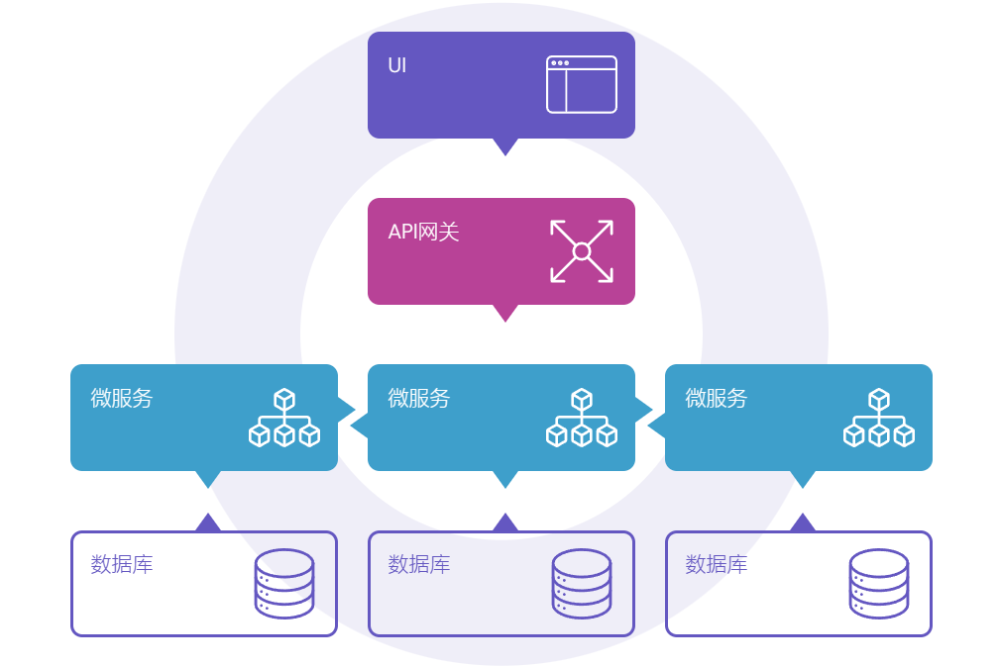
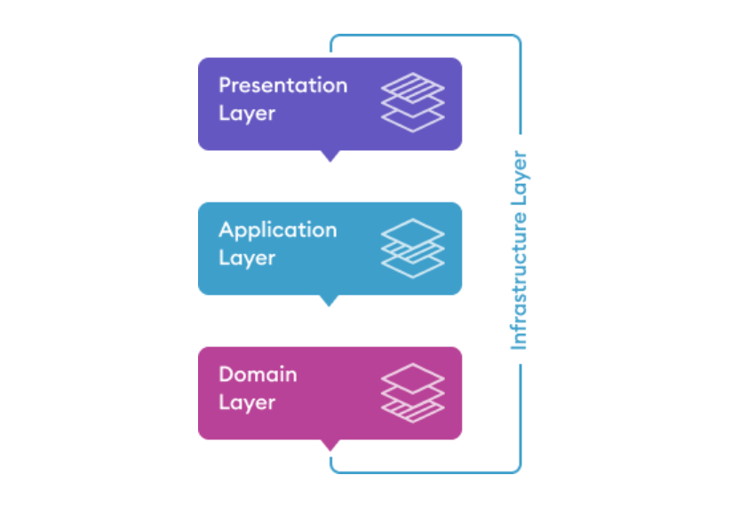
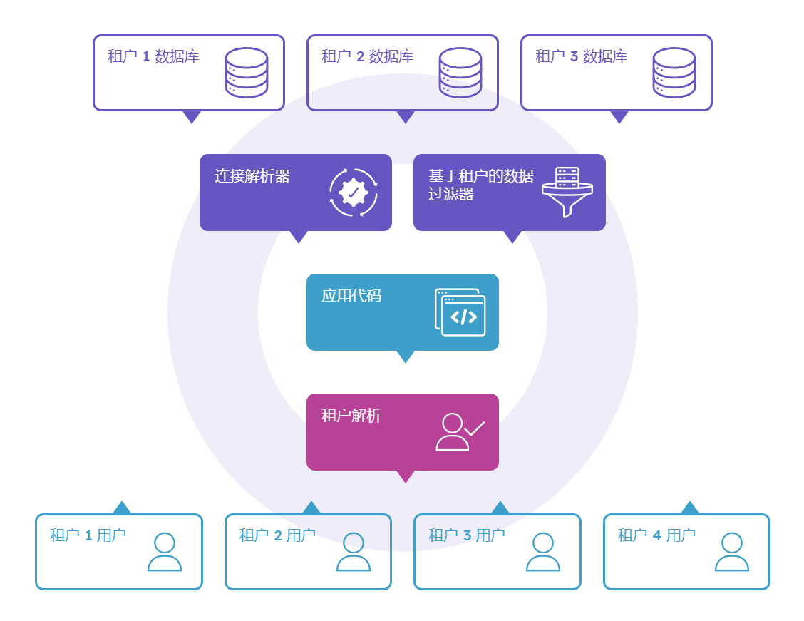
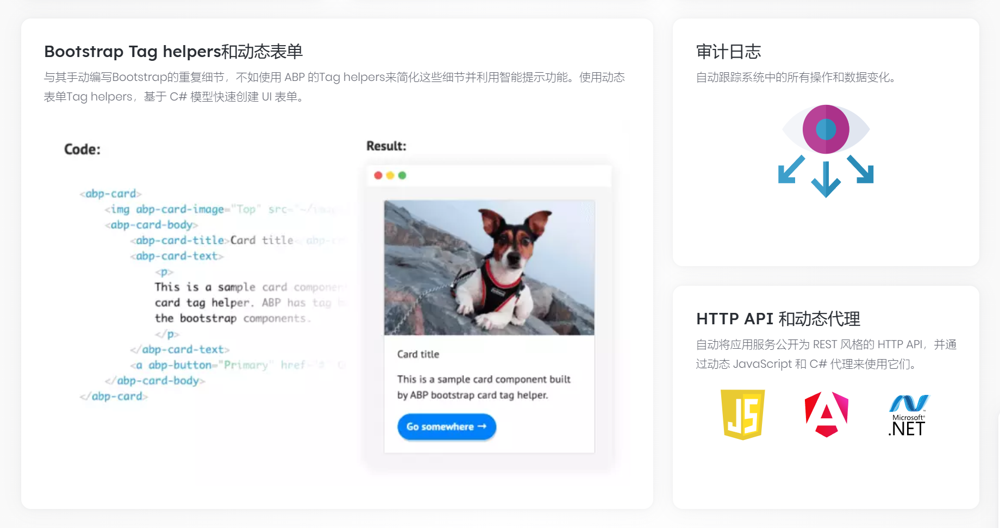

## ABP - 开源 Web 应用程序框架

### 简介

::: tip

[ABP Framework](https://abp.io/) 是一个完整的基础架构，用于创建基于 ASP.NET Core 平台的现代架构软件解决方案。

:::

开源的Web应用框架ABP，专为简化现代Web应用的开发而设计。它基于ASP.NET Core，提供了一套完整的软件开发架构和工具集，帮助开发者构建可维护、可扩展的企业级Web应用程序。

### 架构

ABP框架在设计时就考虑到了微服务架构的需求，提供了服务间通信的支持：



遵循和实施了一系列的软件开发最佳实践和约定，并提供启动模板，基于DDD分层架构和开发原则，建立可维护的代码库：



从数据库到UI到集成了多租户功能，轻松开发SaaS应用：



### 基础设施

ABP框架提供了一系列的基础设施服务，如身份验证与授权、数据访问本地化、依赖注入、UI设计等，减少了开发者在这些通用功能上的工作量。




## ABP CLI

ABP CLI（命令行界面）是一种命令行工具，用于自动执行基于 ABP 解决方案的一些常见操作，简化开发过程：

`Abp New`

- **用途**：使用ABP启动模板创建新的解决方案。
- **示例**：`abp new Acme.BookStore -t app` 创建一个名为`Acme.BookStore` 的新应用。

`Abp Add-Module`

- **用途**：在解决方案中安装预构建应用模块。
- **示例**：`abp add-module Volo.Blogging` 将`Blogging`模块添加到你的项目中。

`Abp Update`

- **用途**：自动更新解决方案中所有与`ABP`相关的`NuGet`和`NPM`包。
- **示例**：`abp update` 更新当前项目中的所有ABP相关包。

更多命令详情，可浏览官方文档：

- [CLI | Documentation Center](https://docs.abp.io/zh-Hans/abp/latest/CLI)

现在，我们打开命令行终端，安装ABP CLI：

```shell
dotnet tool install -g Volo.Abp.Cli
```

