## Todo APP

下面，我们一起跟着官方文档，快速构建一个简单的代办事项应用程序。

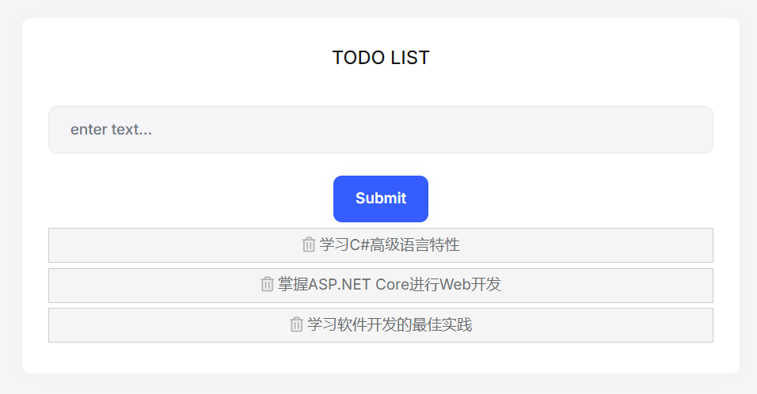

## 创建解决方案

首先，请确保你已经安装了 ABP CLI，可运行以下命令来安装它：

```shell
dotnet tool install -g Volo.Abp.Cli
```

接着，打开你的工作目录，运行以下命令：

```shell
abp new TodoApp -u angular
```

上述命令使用 `ABP CLI` 创建了一个解决方案，名为 "`TodoApp`"，同时使用 `Angular` 作为其前端UI框架。

完成后，我们就得到一个预配置的全栈应用程序，此时包含两个文件夹：

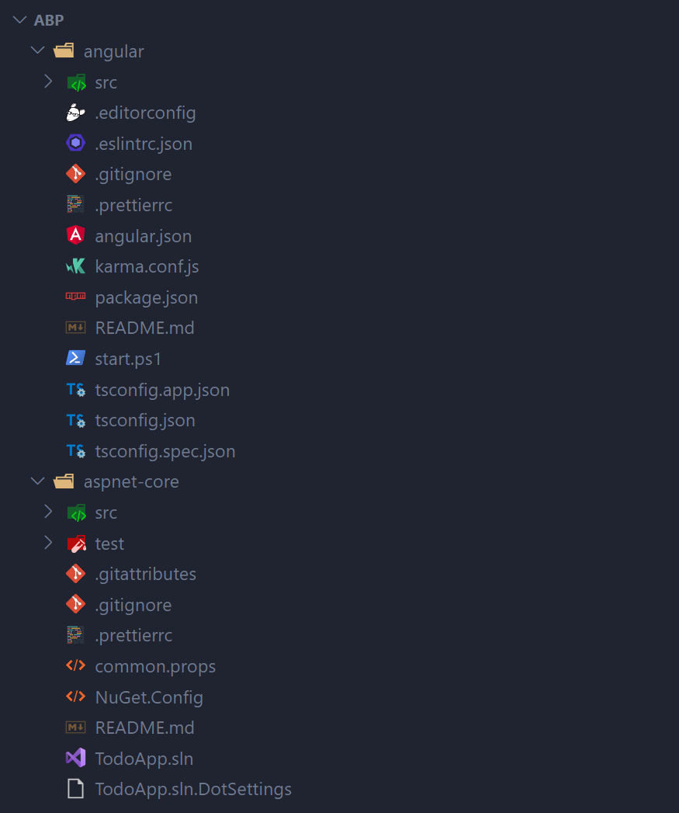

## 创建并初始化数据库

我们用 Visual Studio 打开 `aspnet-core` 项目下的解决方案 `TodoApp.sln`，然后右键单击`TodoApp.DbMigrator`项目，将其配置为启动项目：

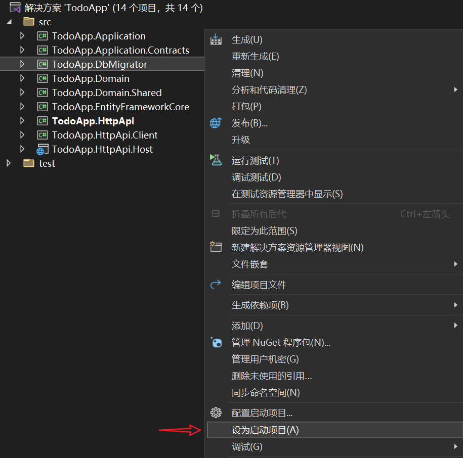

接着运行该项目，此时会**创建数据库并生成初始数据**：

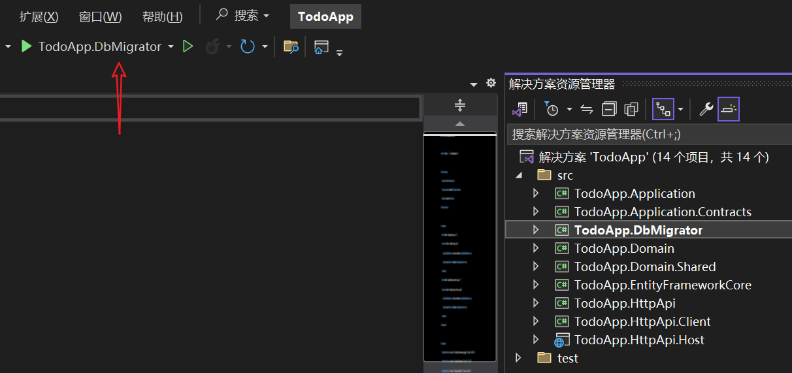

## 运行后台应用程序

### 如何运行？

将启动项目设置为 `TodoApp.HttpApi.Host` ，该项目承载服务器端HTTP API。

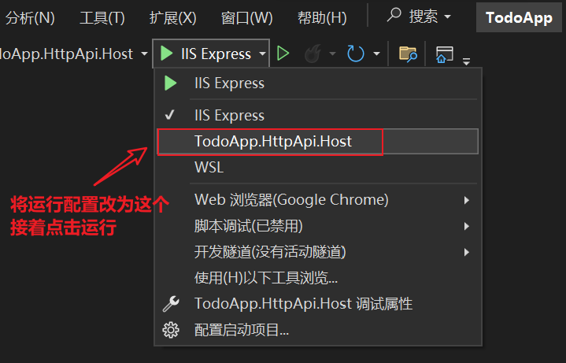

项目运行成功后会自动打开浏览器，访问该项目的 [Swagger UI](https://swagger.io/tools/swagger-ui/) 页面，此时我们可以查看服务端的 HTTP API，效果如下：

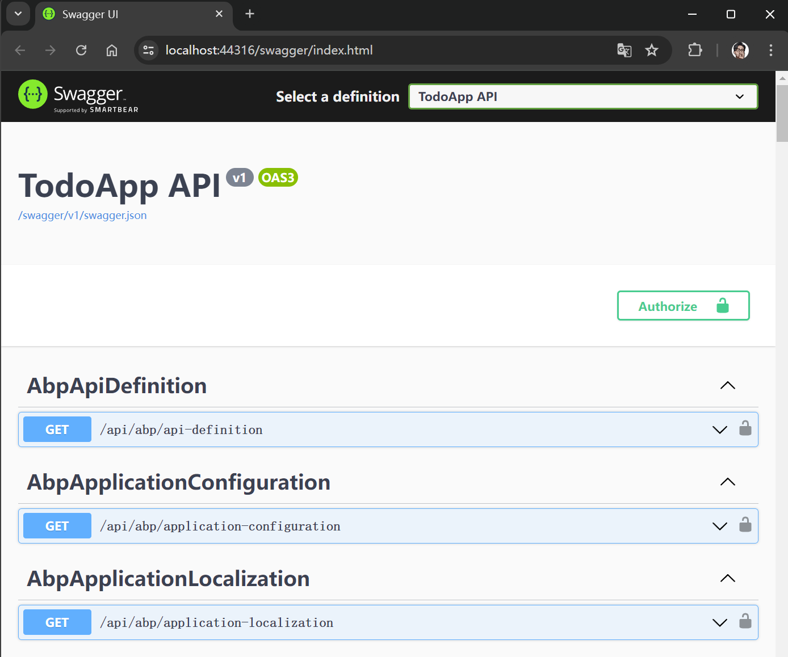

### 出错后的解决方法

如果出现以下错误：

```bash
Unable to bind to https://localhost:44315 on the IPv4 loopback interface: '以一种访问权限不允许的方式做了一个访问套接字的尝试。'.
```

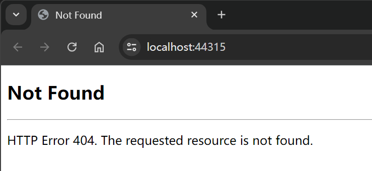

那可能是因为端口已经被另一个应用程序占用，我们可以手动修改端口，请修改项目的配置文件，将访问端口改为其他的，比如 `44316`：

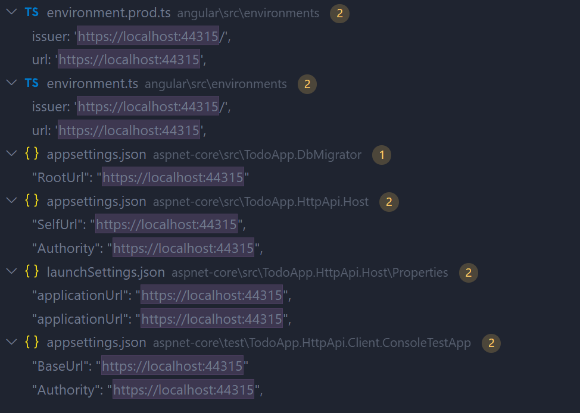

修改端口后，项目成功运行。

## 运行前端项目

我们打开终端命令行窗口，进入 `angular` 项目，运行以下命令进行依赖安装：

```shell
npm install
```

然后运行以下命令，启动应用：

```shell
npm start
```

成功运行后，浏览器会打开前端页面，效果如下：

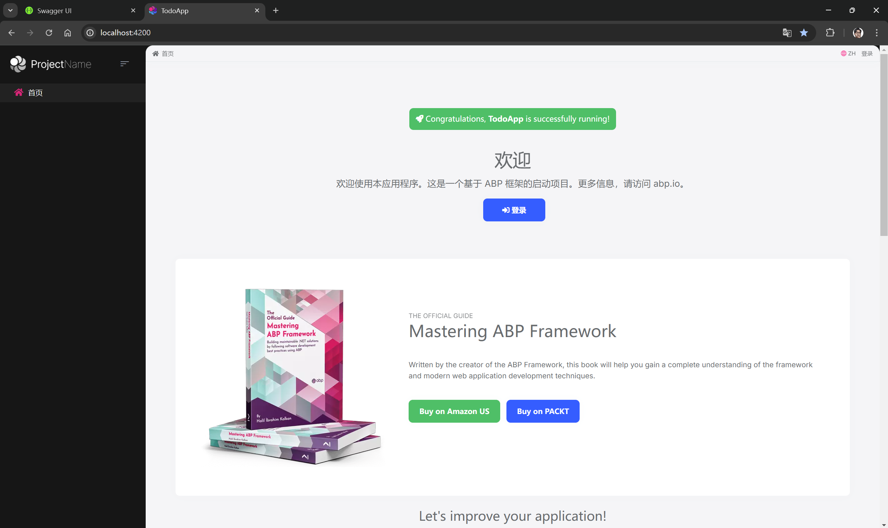

我们可以点击登录按钮，初始账号信息如下：

- 用户名：`admin`
- 密码：`1q2w3E*`

## 在领域层创建实体

在领域驱动设计（DDD）中，实体是核心概念，它代表了具有唯一标识的对象，通常会随着业务操作而改变它的状态。实体通常映射到关系型数据库的表中。

::: tip

实体的主要特征是即使其属性发生变化，只要其唯一标识（ID）保持不变，它仍然被认为是同一个实体。例如，一个人的姓名、地址等信息可能会变，但只要身份证号（假设用作唯一标识）不变，那么无论他的哪些属性如何变化，都认为是同一个人。

:::

接下来，我们在 `TodoApp.Domain` 项目中新建一个 `TodoItem` 类：

```csharp
using System;
using Volo.Abp.Domain.Entities;

namespace TodoApp
{
    public class TodoItem : BasicAggregateRoot<Guid>
    {
        public string Text { get; set; }
    }
}
```

`BasicAggregateRoot` 是创建根实体的最简单的基础类。这表明 `TodoItem` 是一个聚合根，是领域驱动设计中的一个概念，代表领域模型的根实体。 `Guid` 是这里实体的主键 (`Id`)。

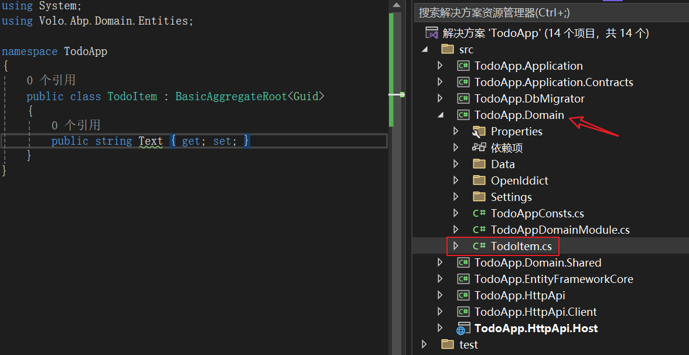

## 将实体映射到数据库中的表

下面，我们来设置 [Entity Framework Core](https://docs.abp.io/zh-Hans/abp/latest/Entity-Framework-Core) 配置。

打开在 `TodoApp.EntityFrameworkCore` 项目中 `EntityFrameworkCore` 文件夹中的 `TodoAppDbContext` 类, 并向该类添加新的 `DbSet` 属性:

```csharp
public DbSet<TodoItem> TodoItems { get; set; }
```

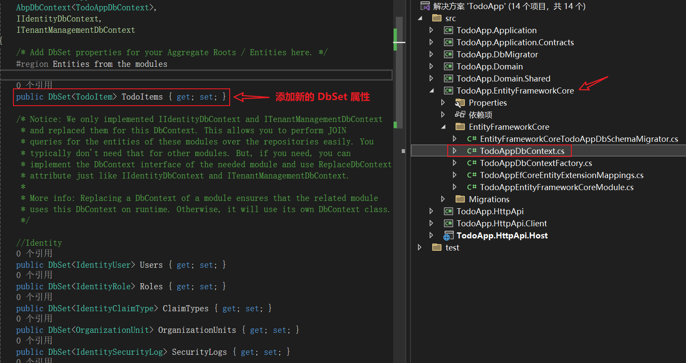

然后在当前这个 `TodoAppDbContext` 类中找到 `OnModelCreating` 方法，并为 `TodoItem` 实体添加映射代码:

```csharp
builder.Entity<TodoItem>(b =>
{
	b.ToTable("TodoItems");
});
```

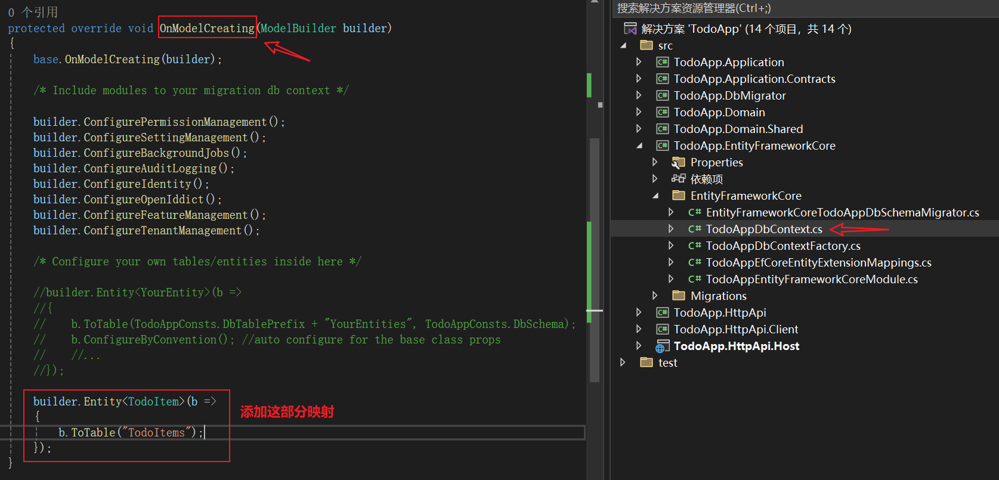

现在，我们就已经将 `TodoItem` 实体映射到数据库中的 `TodoItems` 表。

## Code First 迁移

该模板配置的是Entity Framework Core的 [Code First 迁移](https://docs.microsoft.com/en-us/ef/core/managing-schemas/migrations)。

由于我们更改了数据库映射配置，因此需要创建一个新的迁移并将更改应用于数据库。

在 `TodoApp.EntityFrameworkCore` 项目目录中打开一个命令行终端并输入以下命令：

```bash
dotnet ef migrations add Added_TodoItem
```

这将向项目添加一个新的迁移类。

接着运行以下命令，将更改应用于数据库：

```bash
dotnet ef database update
```

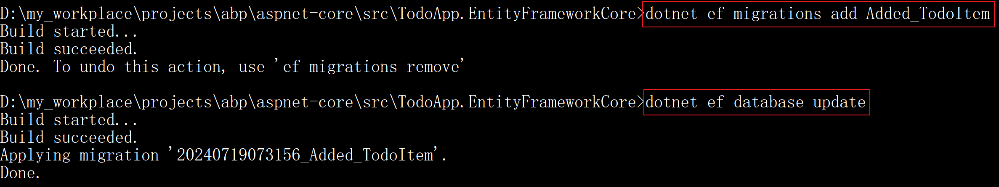

现在，我们可以使用ABP仓库保存和检索待办事项。

## 后台应用层

### 明确接口需求

在ABP框架中，[应用程序服务](https://docs.abp.io/zh-Hans/abp/latest/Application-Services)扮演着执行应用程序核心用例的角色。

为了满足我们的需求，我们将实现以下功能：

- 获取待办事项列表
- 创建新的待办事项
- 删除待办事项

### 数据传输对象（DTO）

应用程序服务通常与数据传输对象（DTO）一起工作，而不是直接使用实体。因此，我们首先需要定义DTO。在 `TodoApp.Application.Contracts` 项目中，我们创建一个名为 `TodoItemDto` 的类：

```csharp
using System;

namespace TodoApp
{
    public class TodoItemDto
    {
        public Guid Id { get; set; }
        public string Text { get; set; }
    }
}
```

这个 `TodoItemDto` 类是一个简单的DTO，用于表示待办事项的数据。

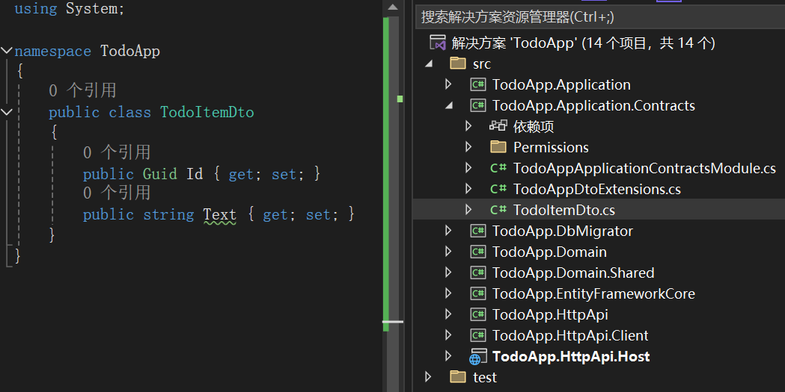

### 定义应用服务接口

接下来，我们定义应用服务接口来规定我们的服务将提供哪些操作。

在 `TodoApp.Application.Contracts` 项目中，创建一个名为 `ITodoAppService` 的接口：

```csharp
using System;
using System.Collections.Generic;
using System.Threading.Tasks;
using Volo.Abp.Application.Services;

namespace TodoApp
{
    public interface ITodoAppService : IApplicationService
    {
        Task<List<TodoItemDto>> GetListAsync();
        Task<TodoItemDto> CreateAsync(string text);
        Task DeleteAsync(Guid id);
    }
}
```

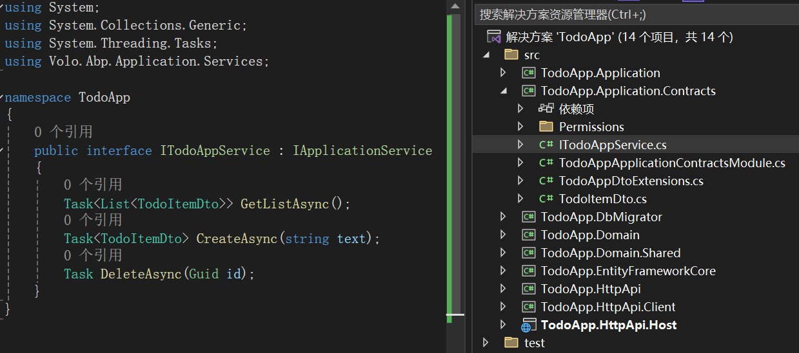

### 实现服务接口

接下来的步骤是实现 `ITodoAppService` 接口。

首先在 *TodoApp.Application* 项目中创建 `TodoAppService` 类：

```csharp
using System;
using System.Collections.Generic;
using System.Threading.Tasks;
using Volo.Abp.Application.Services;
using Volo.Abp.Domain.Repositories;

namespace TodoApp;

public class TodoAppService : ApplicationService, ITodoAppService
{
    private readonly IRepository<TodoItem, Guid> _todoItemRepository;

    public TodoAppService(IRepository<TodoItem, Guid> todoItemRepository)
    {
        _todoItemRepository = todoItemRepository;
    }

    // TODO: Implement the methods here...

    public async Task<List<TodoItemDto>> GetListAsync()
    {
        
    }

    public async Task<TodoItemDto> CreateAsync(string text)
    {

    }

    public async Task DeleteAsync(Guid id)
    {

    }

}
```

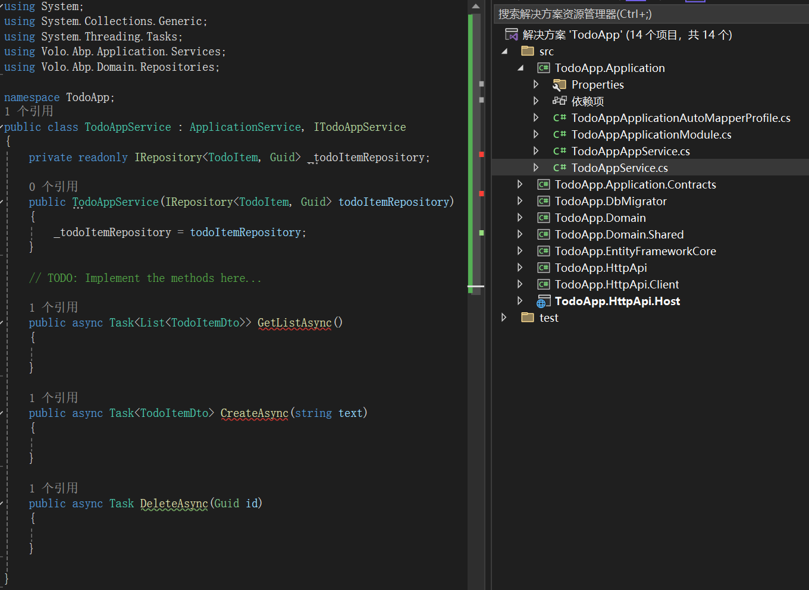

#### GetListAsync

 `GetListAsync` 方法是一个异步方法，用于从仓库（`Repository`）中获取所有待办事项（`TodoItem`）的列表，并将它们转换为数据传输对象（`DTO`）列表以供前端使用。

```csharp
public async Task<List<TodoItemDto>> GetListAsync()
{
    var items = await _todoItemRepository.GetListAsync();
    return items
        .Select(item => new TodoItemDto
                {
                    Id = item.Id,
                    Text = item.Text
                }).ToList();
}
```

#### CreateAsync

仓储的`InsertAsync` 方法不仅保存实例，还返回保存后的实例，包括由数据库生成的任何属性（如 `Id`）。 

我们可以使用`InsertAsync` 返回的`TodoItem` 实例，创建一个新的 `TodoItemDto` 实例，填入 `Id` 和 `Text` 属性并返回供前端使用。

```csharp
public async Task<TodoItemDto> CreateAsync(string text)
{
    var todoItem = await _todoItemRepository.InsertAsync(
        new TodoItem {Text = text}
    );

    return new TodoItemDto
    {
        Id = todoItem.Id,
        Text = todoItem.Text
    };
}
```

#### DeleteAsync

删除操作可以通过调用 `_todoItemRepository.DeleteAsync(id)`，异步地从仓库（Repository）中删除具有指定 `id` 的待办事项：

```csharp
public async Task DeleteAsync(Guid id)
{
    await _todoItemRepository.DeleteAsync(id);
}
```

## 前端生成服务代理

::: tip

ABP提供了一个自动化工具，用于创建客户端服务代理，这使得前端应用能够方便地调用后端提供的HTTP API。

:::

首先，启动后端服务以使其在线。在Visual Studio中找到 `TodoApp.HttpApi.Host` 项目并点击运行按钮。等待项目启动完成。当 [Swagger UI](https://swagger.io/tools/swagger-ui/) 页面后打开后，表明后端服务已成功运行。

接下来，转到前端项目所在的目录。

在`angular`文件夹中打开一个命令行终端并输入以下命令:

```shell
abp generate-proxy -t ng
```

这个命令会让代理生成器读取后端服务的API定义，并在前端项目中创建相应的服务代理，运行效果如下：

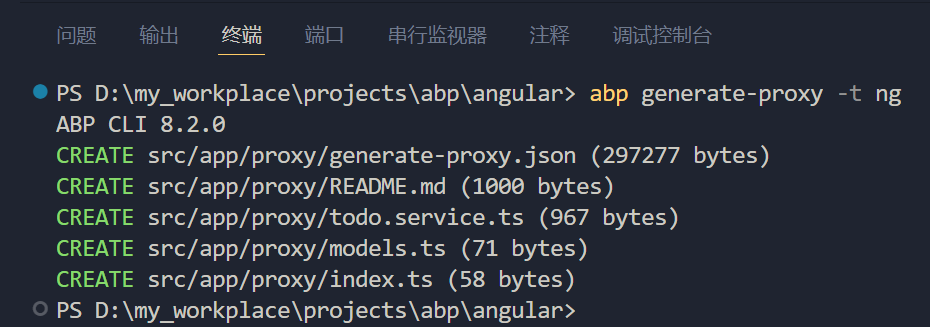

现在，我们就可以在前端应用程序中直接调用后端的HTTP API。

## 前端页面的完善

打开 `angular/src/app/home/home.component.ts` 文件, 并用以下代码替换其内容:

```tsx
import { AuthService } from '@abp/ng.core';
import { ToasterService } from '@abp/ng.theme.shared';
import { Component, OnInit } from '@angular/core';
import { TodoItemDto, TodoService } from '@proxy';

@Component({
  selector: 'app-home',
  templateUrl: './home.component.html',
  styleUrls: ['./home.component.scss'],
})

export class HomeComponent implements OnInit {

  todoItems: TodoItemDto[];
  newTodoText: string;

  constructor(
    private authService: AuthService,
    private todoService: TodoService,
    private toasterService: ToasterService) {

  }

  ngOnInit(): void {
    this.todoService.getList().subscribe(response => {
      this.todoItems = response;
    });
  }

  get hasLoggedIn(): boolean {
    return this.authService.isAuthenticated;
  }

  login() {
    this.authService.navigateToLogin();
  }

  create(): void {
    this.todoService.create(this.newTodoText).subscribe((result) => {
      this.todoItems = this.todoItems.concat(result);
      this.newTodoText = null;
    });
  }

  delete(id: string): void {
    this.todoService.delete(id).subscribe(() => {
      this.todoItems = this.todoItems.filter(item => item.id !== id);
      this.toasterService.info('Deleted the todo item.');
    });
  }
}
```

接着打开 `/angular/src/app/home/home.component.html` 文件, 并用以下代码块替换部分内容：

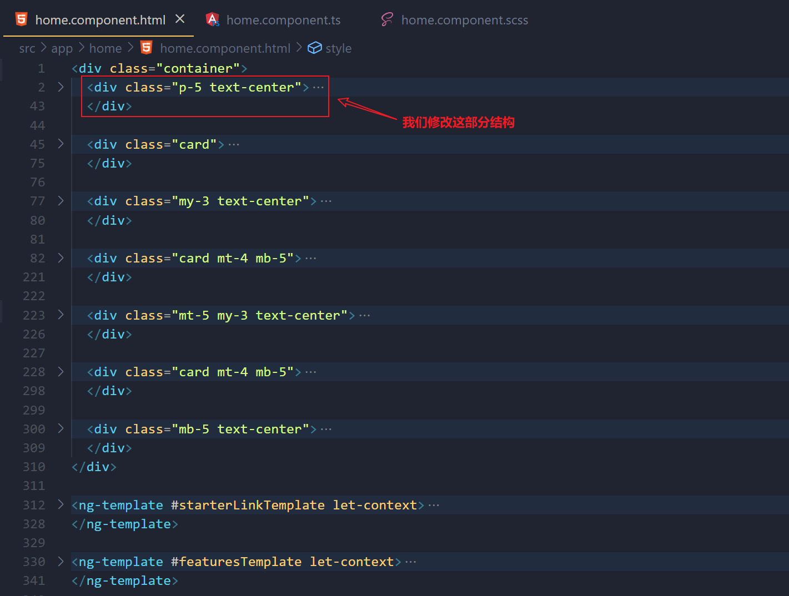

```html
<div class="p-5 text-center">
    <div class="d-inline-block bg-success text-white p-1 h5 rounded mb-4" role="alert">
        <h5 class="m-1">
            <i class="fas fa-rocket" aria-hidden="true"></i> Congratulations,
            <strong>TodoApp</strong> is successfully running!
        </h5>
    </div>
    @if(!hasLoggedIn){
    <h1>{{ '::Welcome' | abpLocalization }}</h1>

    <p class="lead px-lg-5 mx-lg-5">{{ '::LongWelcomeMessage' | abpLocalization }}</p>
    <div>
        <a (click)="login()" class="px-4 btn btn-primary ms-1" role="button">
            <i class="fa fa-sign-in" aria-hidden="true"></i> {{ 'AbpAccount::Login' | abpLocalization }}
        </a>
    </div>
    } @else {
    <div class="container">
        <div class="card">
            <div class="card-header">
                <div class="card-title">TODO LIST</div>
            </div>
            <div class="card-body">
                <!-- FORM FOR NEW TODO ITEMS -->
                <form class="form-inline" (ngSubmit)="create()">
                    <input name="NewTodoText" type="text" [(ngModel)]="newTodoText" class="form-control mr-2"
                           placeholder="enter text..." />
                    <br>
                    <button type="submit" class="btn btn-primary">Submit</button>
                </form>

                <!-- TODO ITEMS LIST -->
                <ul id="TodoList">
                    <li *ngFor="let todoItem of todoItems">
                        <i class="fa fa-trash-o" (click)="delete(todoItem.id)"></i> {{ todoItem.text }}
                    </li>
                </ul>
            </div>
        </div>
    </div>
    }
</div>
```

最后修改一下样式。打开`/angular/src/app/home/home.component.scss` 文件, 并用以下代码块替换其内容：

```scss
/* Styles for the home component */
#TodoList {
    list-style: none;
    margin: 0;
    padding: 0;
}

#TodoList li {
    padding: 5px;
    margin: 5px 0px;
    border: 1px solid #cccccc;
    background-color: #f5f5f5;
}

#TodoList li i {
    opacity: 0.5;
}

#TodoList li i:hover {
    opacity: 1;
    color: #ff0000;
    cursor: pointer;
}
```

最终页面效果如下：

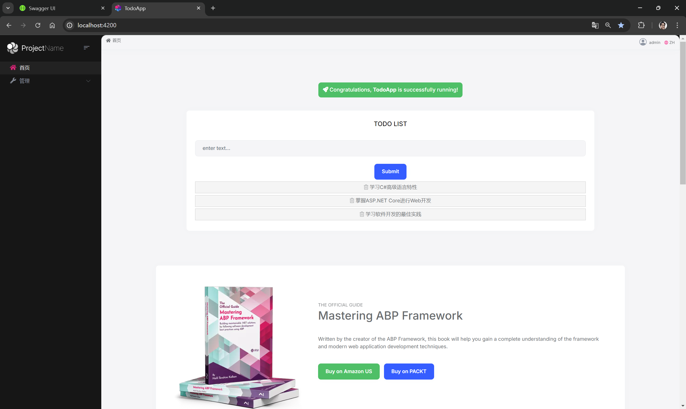

## 总结

综上所述，我们已经建立了一个非常简单的前后端分离的Web应用程序，也了解了ABP框架的基础使用方式。
