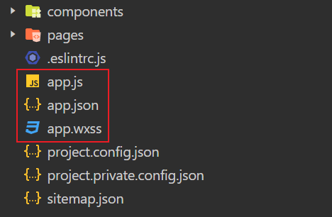
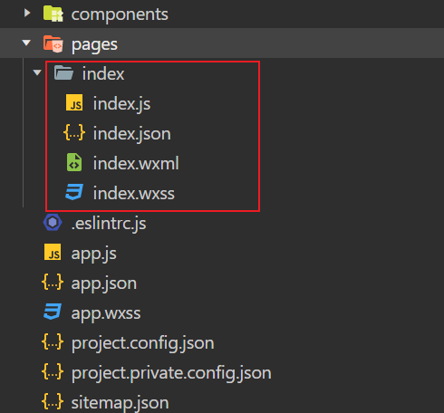
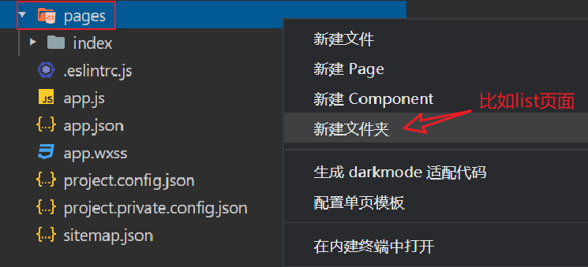
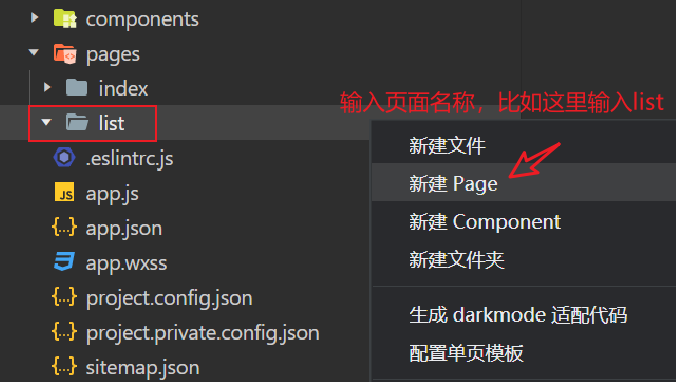
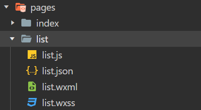
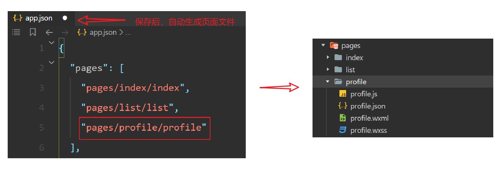

## 目录结构

一个完整的小程序项目通常包含主体文件和页面文件。

### 主体文件

主体文件位于项目根目录下，也称全局文件，可作用于整个小程序，会影响到小程序的每个页面。

主体文件主要有三个文件：

- **app.js** : 小程序的入口文件，用于定义小程序的生命周期函数、全局变量等。

- **app.json** : 全局配置文件，配置小程序的页面路径（路由）、界面表现、网络超时时间等。
- **app.wxss** : 全局样式文件，定义小程序的全局样式。

此外，**project.config.json**文件是项目配置文件，定义了项目的库版本、编译设置、开发者个人设置等信息。**sitemap.json**文件则用于配置小程序及其页面是否允许被微信索引。

::: tip

主体文件的名字必须是 `app`。

:::

### 页面文件

页面文件指的是小程序每个页面所需的文件，每个页面由四个基本文件组成，分别是：

1. **.js** ： 页面的逻辑文件，用于处理用户的交互操作。
2. **.json** ： 页面的配置文件，用于设置当前页面的窗口表现、导航条样式等。
3. **.wxml** ： 页面的结构文件，类似于HTML，用于布局页面。
4. **.wxss** ：页面的样式表文件，类似于CSS，用于设置页面的样式。

每个页面都有自己独立的文件夹，文件夹名称通常与页面名称一致，这些文件夹放在项目的`pages`目录下。此外，还可能包含一些资源文件（如图片）、组件文件等。

注意，`.js`文件和 `.wxml` 文件是必需的。

## 新建页面

在微信开发者工具中新建页面，主要有两种方式。

### 方式一

在项目的`pages`目录下，手动创建一个新的文件夹（文件夹名称即为页面名称）。

接着，右键点击新创建的目录，选择“新建页面”，输入页面名称：

此时微信开发者工具会自动在指定的目录下生成四个基本文件（`.js`、`.json`、`.wxml`、`.wxss`)。

同时，它也会自动在`app.json`的`pages`数组中添加该页面的路径。

### 方式二

另一种新建页面的方式，则是打开`app.json`配置文件，在`pages`数组中添加页面的路径。路径是相对于项目根目录的路径，例如`pages/yourPageName/yourPageName`。当保存`app.json`配置文件后，微信开发者工具会自动在指定的位置生成对应的页面文件，也很方便。

