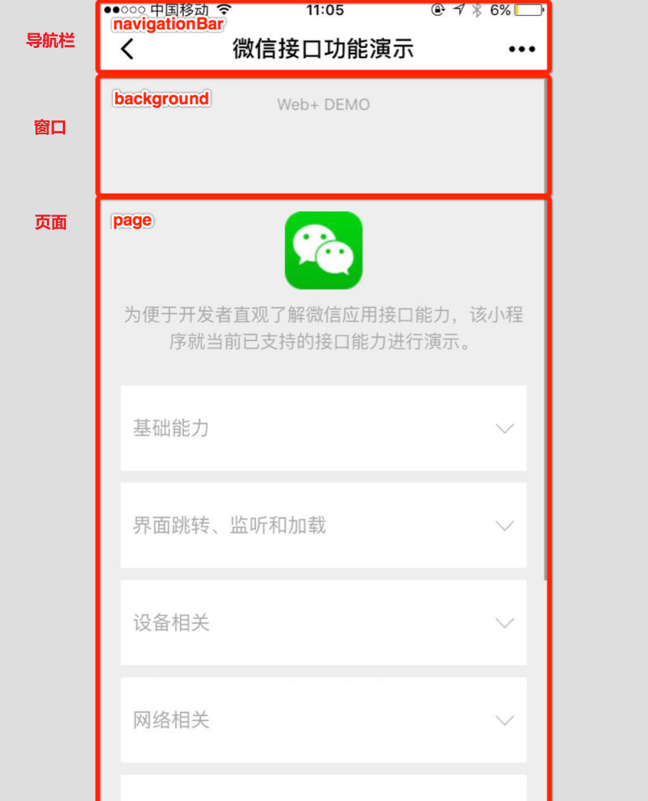
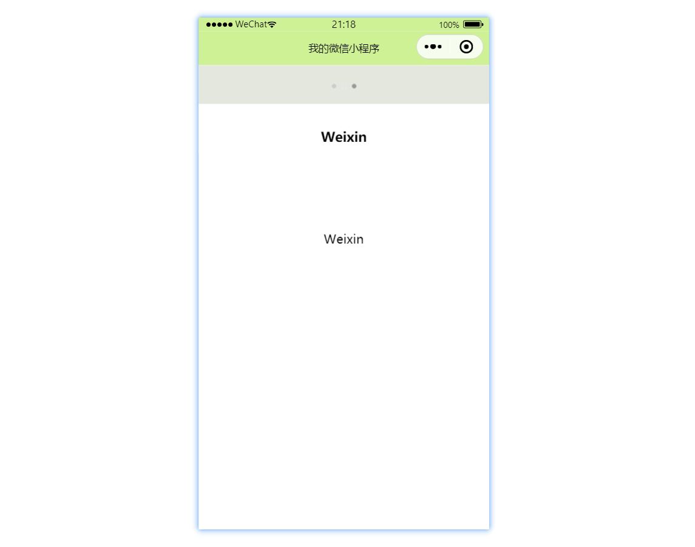

## app.json

项目根目录下的 `app.json` 文件是用来对微信小程序进行全局配置，文件内容为一个 JSON 对象，通过不同的字段来设置小程序的页面路径、窗口表现、路径别名等全局性的配置。

下面给出常规的配置记录，具体可浏览官方文档：[小程序配置 / 全局配置](https://developers.weixin.qq.com/miniprogram/dev/reference/configuration/app.html)

## 配置项

### pages

`pages` 字段是必需字段，它定义了小程序的页面路径列表，该列表指定了小程序由哪些页面组成，同时也决定了页面的加载顺序。每个页面都对应一个路径，这个路径相对于小程序的根目录，并且不需要包含文件扩展名。

格式如下：

```json
{
  "pages": [
    "pages/index/index",
    "pages/logs/logs",
    "pages/about/about"
  ]
}
```

要点：

- 数组中的每一项都是一个字符串，表示页面的路径加文件名（不包括文件后缀）。例如，`"pages/index/index"` 表示小程序根目录下的 `pages/index` 目录中的 `index` 文件。
- 小程序会按照 `pages` 数组中定义的顺序加载页面。如果未指定 `entryPagePath` 字段，则数组中的第一个页面是小程序的首页，即小程序启动时用户看到的第一个页面。
- 如果需要添加新页面到小程序中，需要在 `pages` 数组中添加该页面的路径。

注意：

- 确保每个页面的路径都是唯一的，并且正确指向一个存在的页面文件。
- 页面文件通常包括 `.js`、`.wxml`、`.wxss` 和 `.json` 四种类型的文件，分别负责页面的逻辑、结构、样式和配置。

### entryPagePath

`entryPagePath` 是可选字段，用于指定小程序启动时的**入口页面**，也就是自定义小程序打开时首先展示哪个页面，而不一定是 `pages` 数组中的第一个页面。

比如你的小程序有多个页面，你希望小程序打开时直接进入一个特定的活动页面，而不是首页，你可以在 `app.json` 中使用 `entryPagePath` 来设置：

```json
{
  "entryPagePath": "pages/special-event/special-event",
  "pages": [
    "pages/index/index",
    "pages/logs/logs",
    "pages/special-event/special-event"
  ]
}
```

在这里，即使 `pages/special-event/special-event` 不是 `pages` 数组中的第一个页面，小程序启动时也会首先展示这个特定的活动页面。

注意：

- `entryPagePath` 是可选的。如果不设置，小程序默认会加载 `pages` 数组中的第一个页面作为入口页面。
- 确保 `entryPagePath` 指向的页面路径在 `pages` 数组中存在，否则会导致小程序无法正常启动。
- 使用 `entryPagePath` 可以在特定场景下提供更灵活的用户体验，比如临时推广活动或特别事件。

### window

`window` 字段用于设置小程序的全局窗口表现，影响小程序的所有页面，但可以在各个页面的配置文件中被覆盖。



常见属性如下：

- `navigationBarTitleText`：顶部导航栏标题文字内容。

- `navigationBarBackgroundColor`：顶部导航栏背景颜色，十六进制颜色值。
- `navigationBarTextStyle`：顶部导航文字颜色，只能是 `black` 或 `white`。
- `enablePullDownRefresh`：是否开启下拉刷新，布尔值。
- `backgroundTextStyle`：下拉加载的样式，只能是 `dark` 或 `light`。
- `backgroundColor`：窗口的背景色。
- `onReachBottomDistance`：页面上拉触底事件触发时距页面底部的距离，单位为px。

比如：

```json
"window": {
    "navigationBarTitleText" : "我的微信小程序",
    "navigationBarBackgroundColor": "#CFF196",
    "navigationBarTextStyle" : "black",
    "enablePullDownRefresh" : true,
    "backgroundTextStyle" : "dark",
    "backgroundColor" : "#E3E7DD",
    "onReachBottomDistance" : 50
},
```



要点：

- `navigationBarBackgroundColor`、`navigationBarTextStyle` 和 `navigationBarTitleText` 共同决定了顶部导航栏的样式。
- `backgroundColor` 和 `backgroundTextStyle` 控制小程序背景的颜色和下拉加载动画的样式。
- `enablePullDownRefresh` 和 `onReachBottomDistance` 分别控制是否启用下拉刷新功能以及触底加载更多内容的行为。

注意：

这些设置对所有页面有效，但可以在单个页面的 `.json` 配置文件中进行覆盖，以实现页面特定的表现。