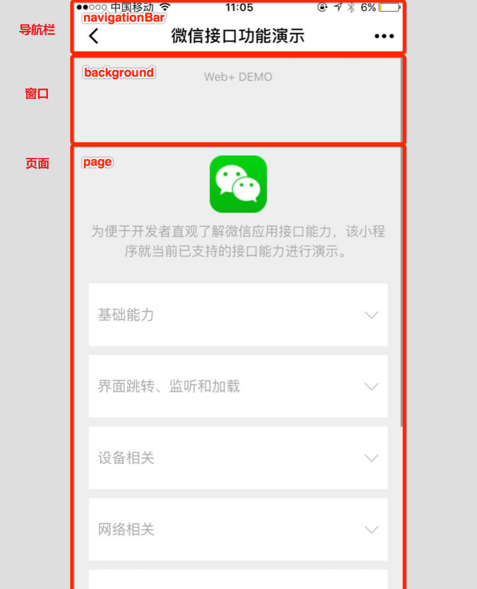
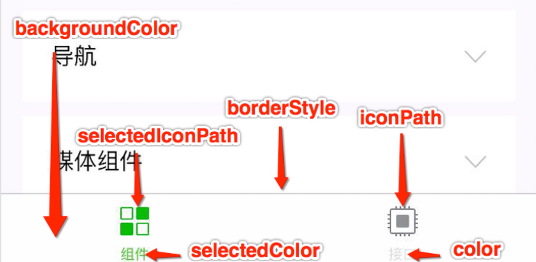
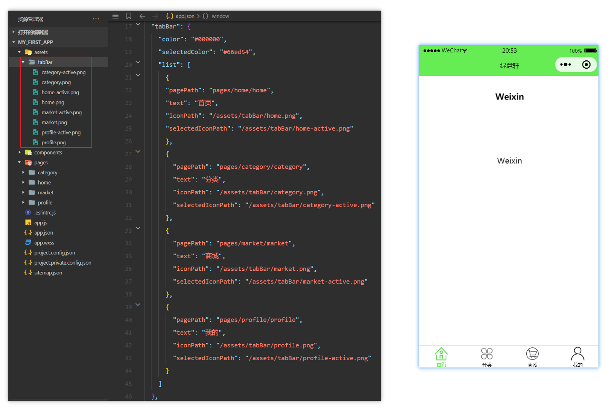
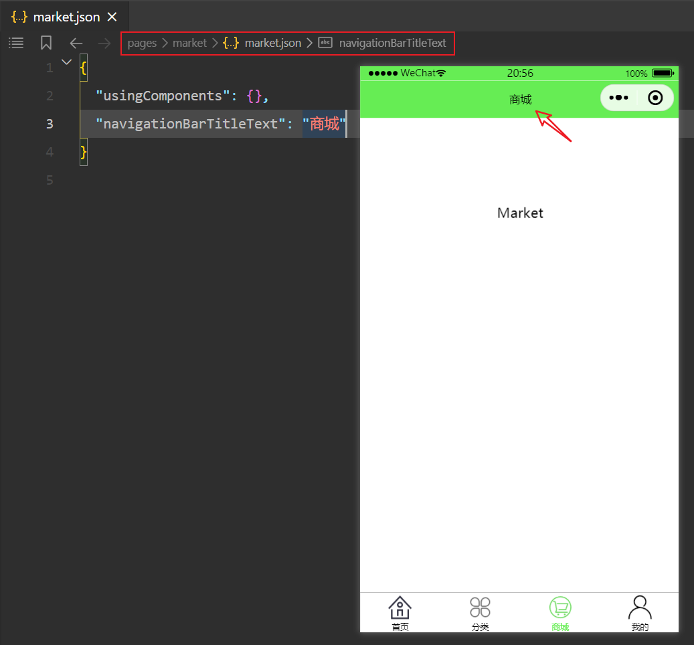
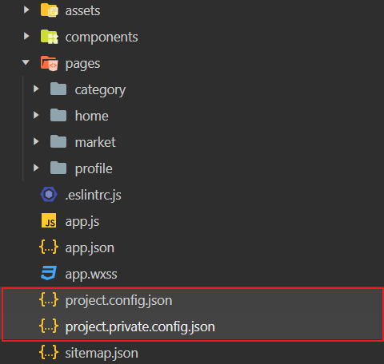
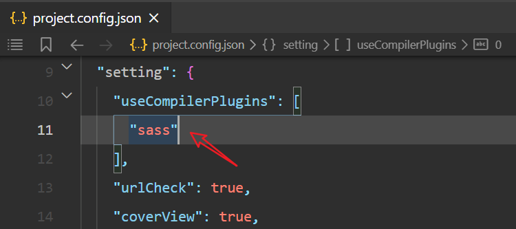

## 全局配置

项目根目录下的 `app.json` 文件是用来对微信小程序进行[全局配置](https://developers.weixin.qq.com/miniprogram/dev/reference/configuration/app.html)，文件内容为一个 JSON 对象，通过不同的字段来设置小程序的页面路径、窗口表现、路径别名等全局性的配置，下面给出常规的全局配置。

### pages

`pages` 字段是必需字段，它定义了小程序的页面路径列表，该列表指定了小程序由哪些页面组成，同时也决定了页面的加载顺序。每个页面都对应一个路径，这个路径相对于小程序的根目录，并且不需要包含文件扩展名。

格式如下：

```json
{
  "pages": [
    "pages/index/index",
    "pages/logs/logs",
    "pages/about/about"
  ]
}
```

要点：

- 数组中的每一项都是一个字符串，表示页面的路径加文件名（不包括文件后缀）。例如，`"pages/index/index"` 表示小程序根目录下的 `pages/index` 目录中的 `index` 文件。
- 小程序会按照 `pages` 数组中定义的顺序加载页面。如果未指定 `entryPagePath` 字段，则数组中的第一个页面是小程序的首页，即小程序启动时用户看到的第一个页面。
- 如果需要添加新页面到小程序中，需要在 `pages` 数组中添加该页面的路径。

注意：

- 确保每个页面的路径都是唯一的，并且正确指向一个存在的页面文件。
- 页面文件通常包括 `.js`、`.wxml`、`.wxss` 和 `.json` 四种类型的文件，分别负责页面的逻辑、结构、样式和配置。

### entryPagePath

`entryPagePath` 是可选字段，用于指定小程序启动时的**入口页面**，也就是自定义小程序打开时首先展示哪个页面，而不一定是 `pages` 数组中的第一个页面。

比如你的小程序有多个页面，你希望小程序打开时直接进入一个特定的活动页面，而不是首页，你可以在 `app.json` 中使用 `entryPagePath` 来设置：

```json
{
  "entryPagePath": "pages/special-event/special-event",
  "pages": [
    "pages/index/index",
    "pages/logs/logs",
    "pages/special-event/special-event"
  ]
}
```

在这里，即使 `pages/special-event/special-event` 不是 `pages` 数组中的第一个页面，小程序启动时也会首先展示这个特定的活动页面。

注意：

- `entryPagePath` 是可选的。如果不设置，小程序默认会加载 `pages` 数组中的第一个页面作为入口页面。
- 确保 `entryPagePath` 指向的页面路径在 `pages` 数组中存在，否则会导致小程序无法正常启动。
- 使用 `entryPagePath` 可以在特定场景下提供更灵活的用户体验，比如临时推广活动或特别事件。

### window

`window` 字段用于设置小程序的全局窗口表现，影响小程序的所有页面，但可以在各个页面的配置文件中被覆盖。



常见属性如下：

- `navigationBarTitleText`：顶部导航栏标题文字内容。

- `navigationBarBackgroundColor`：顶部导航栏背景颜色，十六进制颜色值。
- `navigationBarTextStyle`：顶部导航文字颜色，只能是 `black` 或 `white`。
- `enablePullDownRefresh`：是否开启下拉刷新，布尔值。
- `backgroundTextStyle`：下拉加载的样式，只能是 `dark` 或 `light`。
- `backgroundColor`：窗口的背景色。
- `onReachBottomDistance`：页面上拉触底事件触发时距页面底部的距离，单位为px。

比如：

```json
"window": {
    "navigationBarTitleText" : "我的微信小程序",
    "navigationBarBackgroundColor": "#CFF196",
    "navigationBarTextStyle" : "black",
    "enablePullDownRefresh" : true,
    "backgroundTextStyle" : "dark",
    "backgroundColor" : "#E3E7DD",
    "onReachBottomDistance" : 50
},
```


要点：

- `navigationBarBackgroundColor`、`navigationBarTextStyle` 和 `navigationBarTitleText` 共同决定了顶部导航栏的样式。
- `backgroundColor` 和 `backgroundTextStyle` 控制小程序背景的颜色和下拉加载动画的样式。
- `enablePullDownRefresh` 和 `onReachBottomDistance` 分别控制是否启用下拉刷新功能以及触底加载更多内容的行为。

注意：

这些设置对所有页面有效，但可以在单个页面的 `.json` 配置文件中进行覆盖，以实现页面特定的表现。

### tabBar

`tabBar`对象用于配置小程序的底部或顶部标签栏，用于实现页面之间的切换。

主要属性如下：



- `color`：未选中标签的颜色。
- `selectedColor`：选中标签的颜色。
- `backgroundColor`：标签栏的背景色。
- `position`：标签栏的位置，仅支持 `bottom` / `top`
- `borderStyle`：标签栏上边框的颜色，仅支持`black`/`white`。
- `list`：标签栏的标签项列表，每一个对象都是一个标签页。
  - `pagePath`：当前页面的路径，即pages数组定义的某个页面路径。
  - `text`：标签下的文字，说明当前页面的含义和用途。
  - `iconPath`：标签图标的路径，大小限制为40kb，建议尺寸为 81px * 81px，不支持网络图片。
  - `selectedIconPath`：选中时的标签图标路径，大小限制为40kb，建议尺寸为 81px * 81px，不支持网络图片。

示例如下：



注意：

- 当 `position` 为 `top` 时，不显示 icon。
- `list` 接受一个数组，**只能配置最少 2 个、最多 5 个 tab**。

## 页面配置

在小程序中，每个[页面配置](https://developers.weixin.qq.com/miniprogram/dev/reference/configuration/page.html)可以使用同名的 `.json` 配置文件来对当前页面进行个性化配置，比如导航栏、窗口背景色、下拉刷新等，此时称为局部配置。

注意：页面配置文件的属性，和全局配置文件 `app.json` 中的 `window` 属性几乎一致，只不过无需指定 `window` 字段而已。当出现相同配置时，页面配置会覆盖掉全局配置。

以下是一些常见的页面配置项：

1. **`navigationBarBackgroundColor`**：设置页面导航栏的背景颜色。
2. **`navigationBarTextStyle`**：设置页面导航栏标题的颜色，只能是`black`/`white`。
3. **`navigationBarTitleText`**：设置页面导航栏的标题。
4. **`backgroundColor`**：设置页面（窗口）的背景色。
5. **`backgroundTextStyle`**：设置下拉加载的样式，只能是`dark`/`light`。
6. **`enablePullDownRefresh`**：设置是否开启下拉刷新。
7. **`onReachBottomDistance`**：设置页面上拉触底事件触发时距页面底部距离，单位为px。



## 项目配置

在小程序项目根目录下，有两个项目配置文件：



其中：

- **project.config.json** 用于定义项目的公共配置，如项目的AppID、项目名称、编译设置等，该配置文件对所有参与项目的开发者都是共享的。
- **project.private.config.json** 则用于存储开发者的个人配置，比如合法域名校验。该文件不会被加入到版本控制系统中，当开发者更换工作环境或重新安装微信开发者工具时，这个文件可以帮助快速恢复到之前的个性化开发环境设置。

## 配置Sass

Sass（Syntactically Awesome Stylesheets）是一种强大的CSS扩展语言，用于简化和增强CSS的编写，它提供了许多有用的特性，如变量、嵌套规则、混合（Mixins）、继承（Inheritance）、以及颜色操作等。

Sass有两种语法格式：
- SCSS（Sassy CSS）：这种格式使用`.scss`扩展名，它的语法完全兼容CSS，同时增加了Sass的新特性。
- 缩进语法（也称为Sass）：这种格式使用`.sass`扩展名，它采用缩进而不是大括号和分号来区分代码块，使得代码更加简洁。

更多内容可参考官方文档：

- [Sass：世界上最成熟、稳定和强大的CSS扩展语言](https://www.sass.hk/)

开发小程序时，我们可以 `project.config.json` 文件中设置Sass编译：



此时，我们就可以直接编写Sass代码，开发者工具会将其编译成普通的CSS代码。