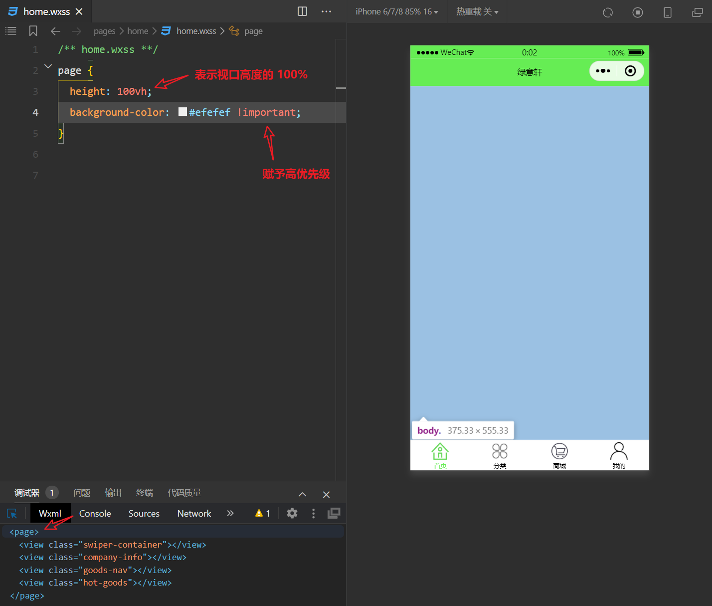

## 概述

在小程序开发中，页面的结构和样式的编写与传统的Web开发有一点点不同。

在Web开发中，页面的结构由HTML编写，使用了如 `div`、`p`、`img`、`a` 等标签来构建页面的骨架。而页面的样式（外观）由CSS负责，通过类选择器（`.class`）、ID选择器（`#id`）等规则来定义元素的外观和布局。但在开发微信小程序时，并不是使用HTML标签，而是使用小程序提供的标记语言和样式语言来代替HTML和CSS。

具体的，小程序使用WXML来进行页面结构的编写。WXML与HTML相似，并将标签称为组件，如view、text、image、navigator等。

::: tip

[WXML](https://developers.weixin.qq.com/miniprogram/dev/framework/view/wxml/)（WeiXin Markup Language）是框架设计的一套标签语言，结合[基础组件](https://developers.weixin.qq.com/miniprogram/dev/component/index.html)、[事件系统](https://developers.weixin.qq.com/miniprogram/dev/framework/view/wxml/event.html)，可以构建出页面的结构。

:::

对于样式编写，小程序使用WXSS，它是对CSS的扩充和修改。WXSS支持大部分CSS的特性，但也引入了一些特有的特性，比如尺寸单位rpx。需要注意的是，WXSS仅支持部分CSS选择器，同时具有全局样式与局部样式的概念。

::: tip

[WXSS](https://developers.weixin.qq.com/miniprogram/dev/framework/view/wxss.html) (WeiXin Style Sheets)是一套样式语言，用于描述 WXML 的组件样式。与 CSS 相比，WXSS 扩展的特性有尺寸单位和样式导入。

:::

## 组件 - WXML

### 常用组件

| 组件名称                       | 描述                                                         |
| ------------------------------ | ------------------------------------------------------------ |
| **view 组件**                  | 相当于 HTML 中的 div 标签，是一个容器组件，可以用来包含其他组件。 |
| **swiper 和 swiper-item 组件** | swiper 是滑块视图容器，常用于制作轮播图。swiper-item 必须是 swiper 组件中的子组件，用来指定每个滑块的内容。 |
| **image 组件**                 | 用于显示图片，可以设置图片的源地址、模式等属性。             |
| **text 组件**                  | 用于显示文本，可以包含多个 text 组件，并且可以通过嵌套来实现文本的部分样式设置。 |
| **navigator 组件**             | 用于页面跳转，可以设置跳转的目标页面路径，类似于 HTML 中的 a 标签。 |
| **scroll-view 组件**           | 用于创建一个可滚动的视图区域，可以设置水平或垂直滚动，以及滚动到指定位置的功能。 |

### 首页结构

```html
<!-- home.wxml - 首页 -->

<!-- 轮播图区域 -->
<view class="swiper-container"></view>

<!-- 公司信息 -->
<view class="company-info"></view>

<!-- 商品导航 -->
<view class="goods-nav"></view>

<!-- 推荐商品 -->
<view class="hot-goods"></view>
```



### 


## 样式 - WXSS

### rpx

::: tip

`rpx` 是微信小程序中引入的一种**自适应单位**，用于解决不同设备屏幕宽度多样化带来的适配问题。与传统的 `px`（像素）单位不同，`rpx` 能够根据屏幕宽度自动进行缩放，实现不同设备上的界面自适应。

:::

在微信小程序中，无论手机型号如何，屏幕宽度都被定义为 `750rpx`。在这个定义下，我们定义的样式就可以根据不同手机根据屏幕宽度来进行自适应。

官方建议，设计师可以使用 iPhone6 作为视觉稿的标准。 iPhone6 的物理像素宽度为375px，那么，在iPhone6屏幕上，1rpx等于0.5px。

### 全局样式与局部样式

定义在 `app.wxss` 文件中的样式被视为全局样式，全局样式适用于小程序内的所有页面，使用全局样式可以确保小程序内各个页面在视觉上保持一致性，适合定义整个应用通用的样式规则，如字体、颜色主题等。

局部样式是在单个页面的`.wxss`文件中定义的样式，仅适用于该页面。每个页面可以有自己的`.wxss`文件，其中定义的样式规则只会影响该页面，不会对其他页面产生影响，主要用于定义页面特有的样式规则，如该页面特定布局、控件的外观等。

当全局样式与局部样式发生冲突时，局部样式会覆盖全局样式。

### 选择器

WXSS 支持多种选择器，用于定位和应用样式到页面的不同元素，如下所示：

1. **.class选择器**：
   - **样例**：`.intro`
   - **描述**：选择所有拥有`class="intro"`的组件。类选择器用于应用样式到所有具有指定类名的元素。

2. **#id选择器**：
   - **样例**：`#firstname`
   - **描述**：选择拥有`id="firstname"`的组件。ID选择器用于标识页面上的唯一元素。

3. **element选择器**：
   - **样例**：`view`
   - **描述**：选择所有`view`组件。元素选择器会用于根据小程序的组件类型来应用样式，如`view`、`text`等。

4. **element, element选择器**：
   - **样例**：`view, checkbox`
   - **描述**：选择所有文档的`view`组件和所有的`checkbox`组件。组合选择器允许同时对多种类型的元素应用相同的样式。

5. **::after伪元素选择器**：
   - **样例**：`view::after`
   - **描述**：在`view`组件后边插入内容。伪元素选择器`::after`用于在选定元素的内容之后插入新的内容。

6. **::before伪元素选择器**：
   - **样例**：`view::before`
   - **描述**：在`view`组件前边插入内容。伪元素选择器`::before`用于在选定元素的内容之前插入新的内容。

### 样式导入

我们可以将公共的样式规则定义在单独的文件中，然后在需要的地方通过`@import`语句进行导入，这有助于样式的复用和模块化管理。

```css
@import "common.wxss";

.container {
  padding: 200rpx 0;
  box-sizing: border-box;
} 
```

这里表示从当前样式文件中导入`common.wxss`文件中定义的所有样式规则。`@import`语句后面跟着的是被导入的外联样式表的相对路径，路径需要用双引号`""`包围。每个`@import`语句的末尾都需要用分号`;`表示语句结束。
